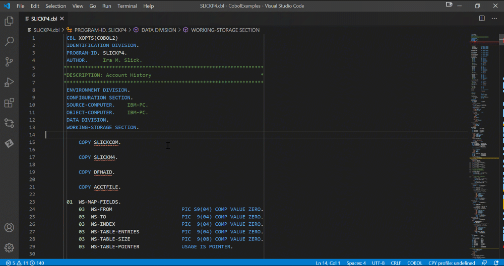
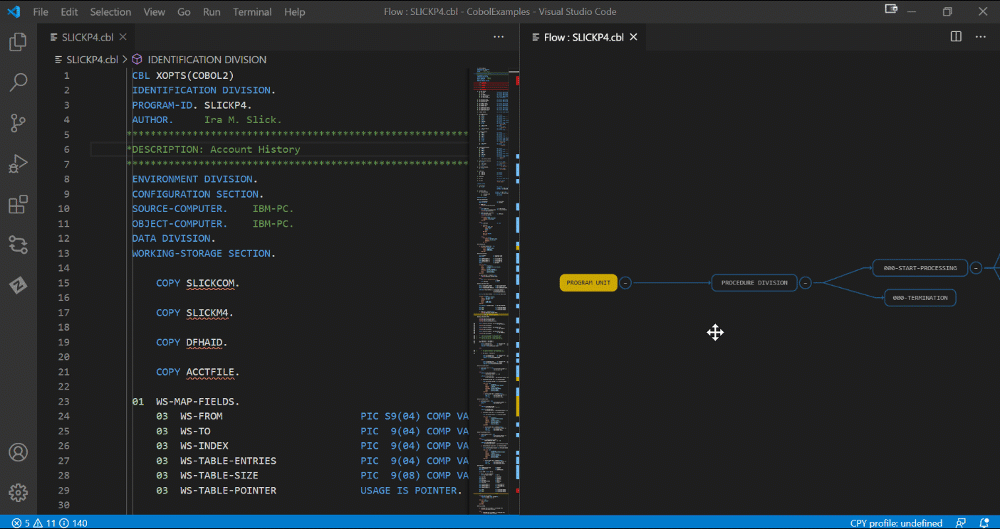
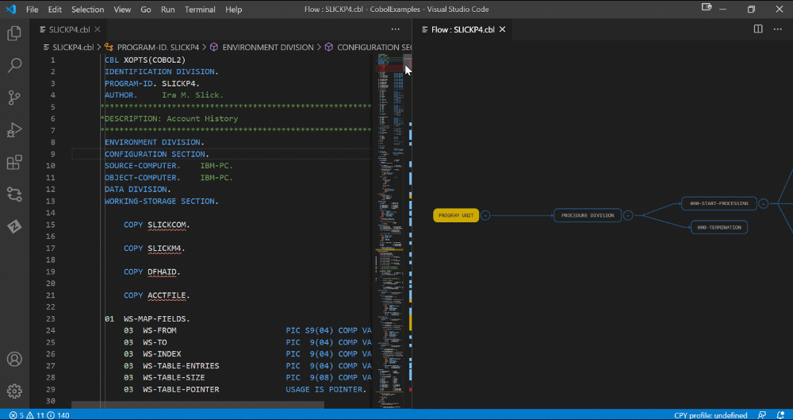
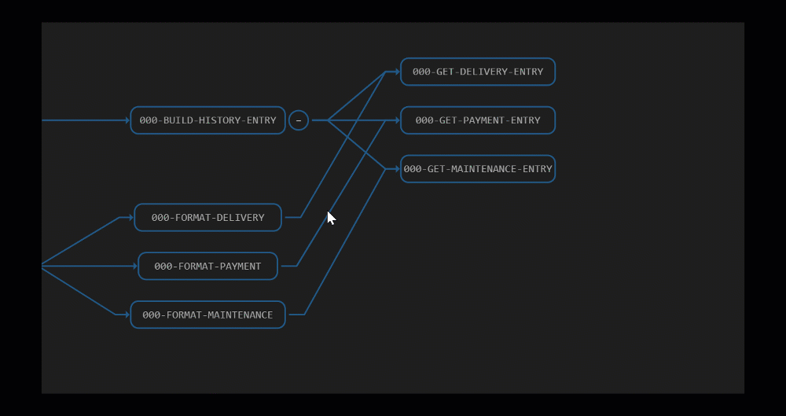

# Cobol Control Flow

Cobol Control Flow is an extension for Visual Studio Code that provides graphical visualization of program flow for programs written in the Cobol language. The extension is designed to help Cobol developers to quickly comprehend and debug cobol programs with which they may not be familiar.

Cobol Control Flow displays paragraphs of a Cobol program as graphical nodes inside an interactive graph. The edges of the graph are drawn based on the 'PERFORM' Cobol execution statements. You can interact with the graph to navigate to the relevant parts of the Cobol code, or you can navigate from the Cobol code to the relevant nodes in the graph.

> **Note:** We recommend you also install [COBOL Language Support](https://marketplace.visualstudio.com/items?itemName=broadcomMFD.cobol-language-support) for COBOL code syntax awareness and to avoid generating Cobol Control Flow graphs from a syntactically faulty code.

## Getting Started

### Prerequisites

- Visual Studio Code version 1.46.0 or higher.

### Supported file types

The extension is activated for Cobol files with the following file extensions:
 - .cobol
 - .cob
 - .cbl

## Using Cobol Control Flow

###  Generate a Cobol Control Graph

To use the Cobol Control Flow interactive graph you must first generate it.

**Follow these steps:**
1. Open a Cobol file.
2. Right click inside the file editor.
    - The context menu opens.
3. Select *View COBOL Control Flow*.
    - The Cobol Control Flow graph is generated and displayed in a new window located to the side of the Cobol file.

### Navigate through the code using Cobol Control Graph

Once the Cobol Control Flow graph is generated you can navigate through the Cobol code by clicking on the individual nodes in the graph.

Conversely you can navigate to the relevant node in the graph from the Cobol code.

**Follow these steps:**

1. In the Cobol file editor, right click inside a paragraph.
    - The context menu opens.
2. Select *View COBOL Control Flow*.
    - The node corresponding to the paragraph is highlighted in the graph.

### Display Tooltips

Hovering over a node in the Cobol Control Flow graph displays first several lines of the corresponding paragraph.

## Privacy Notice
The extensions for Visual Studio Code developed by Broadcom Inc., including its corporate affiliates and subsidiaries, ("Broadcom") are provided free of charge, but in order to better understand and meet its users’ needs, Broadcom may collect, use, analyze and retain anonymous users’ metadata and interaction data, (collectively, “Usage Data”) and aggregate such Usage Data with similar  Usage Data of other Broadcom customers. Please, find more detailed information in License and Service Terms & Repository.

This data collection uses built-in Microsoft VS Code Telemetry, which can be disabled, at your sole discretion, if you do not want to send Usage Data.

Current release of COBOL Control Flow will collect anonymous data for the following events:
- Activation of this VS Code extension
- Interaction with the nodes
- Use of zoom
- Collapse and expand of graph edges
- Count of lines of analyzed COBOL file (Performance)
- Parsing time (Performance)
- Rendering time (Performance)

Each such event is logged with the following information:
- Event time
- Operating system and version
- Country or region
- Anonymous user and session ID
- Version numbers of Microsoft VS Code and COBOL Control Flow
