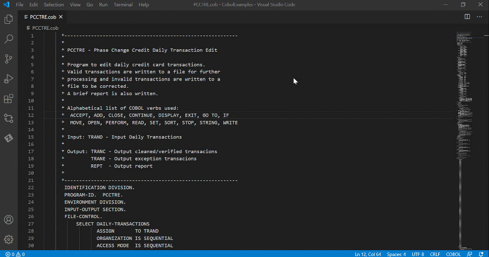

# Cobol Control Flow

Cobol Control Flow is an extension for Visual Studio Code that provides graphical visualization of control flow for programs written in the Cobol language.

The extension displays divisions and sections of a Cobol program inside an interactive graph. The extension has been designed to help Cobol developers to quicker comprehend and debug Cobol programs with which they may not be familiar.

## Getting Started

### Prerequisites

- Visual Studio Code version 1.46.0 or higher.

### Supported file types

The extension is activated for Cobol files with the following file extensions:
 - .cobol
 - .cob
 - .cbl

## Using Cobol Control Flow

###  Generate the Graph

To use the Cobol Control Flow interactive graph you must first generate it.

**Follow these steps:**
1. Open a Cobol file.
2. Right click inside the file editor.
    - The context menu opens.
3. Select *View Program Flow*.
    - The Cobol Program Flow graph is generated and displayed in a new window to the side of the Cobol file.

### Show a Statement in the  Graph

Once the Cobol Control Flow graph is generated you can navigate through the Cobol program by clicking on the individual nodes in the graph. Conversely you can also navigate to nodes from the Cobol code itself.

**Follow these steps:**

> **Note:** Make sure to generate a Cobol Program Flow graph before proceeding.

1. Right click inside the file editor, inside a statement.
    - The context menu opens.
2. Select *Show in Graph*.
    - The statement is highlighted in the Cobol Program Flow graph.
3. (Optional) Click on a statement inside the Cobol Program Flow graph to highlight it and navigate to it inside the Cobol file editor.
