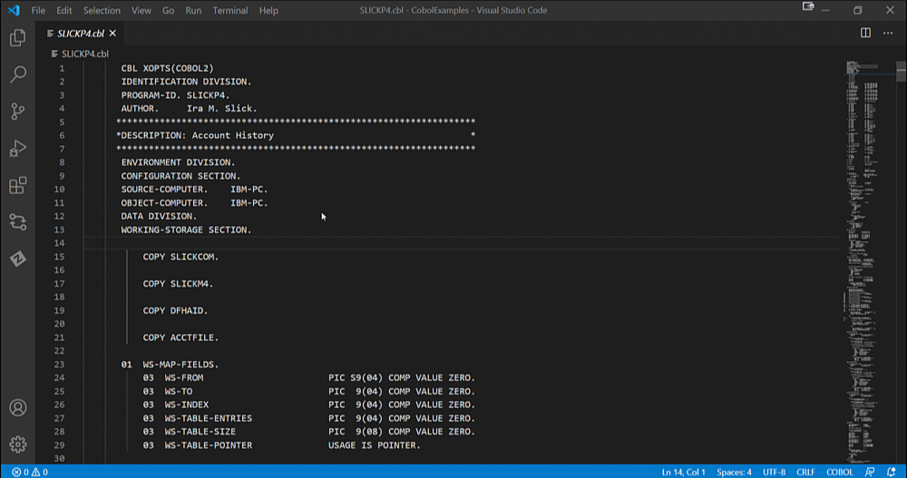
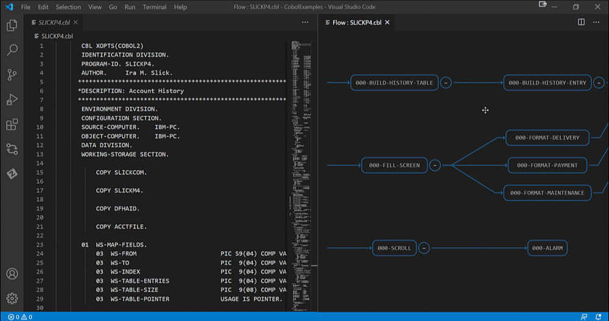
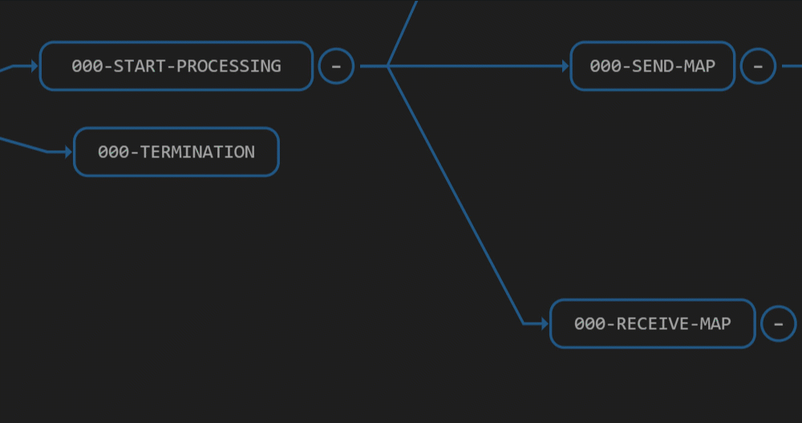

# Cobol Control Flow

Cobol Control Flow is an extension for Visual Studio Code that provides graphical visualization of program flow for programs written in the Cobol language. The extension has been designed to help Cobol developers to quickly comprehend and debug cobol programs with which they may not be familiar.

Cobol Control Flow displays paragraphs of a Cobol program as graphical nodes inside an interactive graph. The edges of the graph are drawn based on the 'PERFORM' Cobol execution statements. You can interact with the graph to navigate to the relevant parts of the Cobol code, or alternatively you can navigate from the Cobol code to the to the relevant nodes on the graph.

## Getting Started

### Prerequisites

- Visual Studio Code version 1.46.0 or higher.

### Supported file types

The extension is activated for Cobol files with the following file extensions:
 - .cobol
 - .cob
 - .cbl

## Using Cobol Control Flow

###  Generate a Cobol Control Graph

To use the Cobol Control Flow interactive graph you must first generate it.

**Follow these steps:**
1. Open a Cobol file.
2. Right click inside the file editor.
    - A context menu opens.
3. Select *View Program Flow*.
    - The Cobol Control Flow graph is generated and displayed in a new window located to the side of the Cobol file.

### Show a Paragraph in the Cobol Control Graph

Once the Cobol Control Flow graph is generated you can navigate through the Cobol code by clicking on the individual nodes in the graph.

**Follow these steps:**

1. In the Cobol file editor, right click inside a paragraph.
    - A context menu opens.
2. Select *View Program Flow*.
    - The node corresponding to the paragraph is highlighted in the Cobol Control Flow graph.

Conversely you can also navigate to nodes from the Cobol code itself: 
Click on a node inside the Cobol Control Flow graph to highlight the corresponding paragraph inside the Cobol file editor.

### Display Tooltips

Hovering over a node in the Cobol Control Flow graph displays first several lines of the corresponding paragraph.